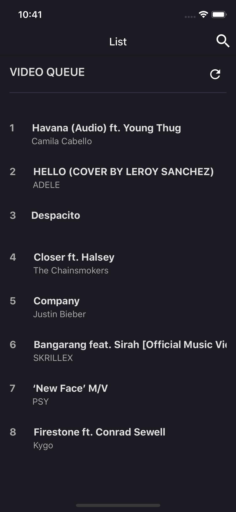

# SongBox

SongBox is crowdsourced video queue application that allows people who are at a social gathering or restaurant to add their favorite music video to the playlist via smartphones. The mobile native app allows people to see the current playlist, search their favorite videos from YouTube and update playlist.

## Live Link
- App(use Expo to run): https://expo.io/@chrisms91/songboxx
- Player: https://songboxx.herokuapp.com/

## Tech Stack
- React
- React Native
- MongoDB
- YouTube API

### Screenshots

